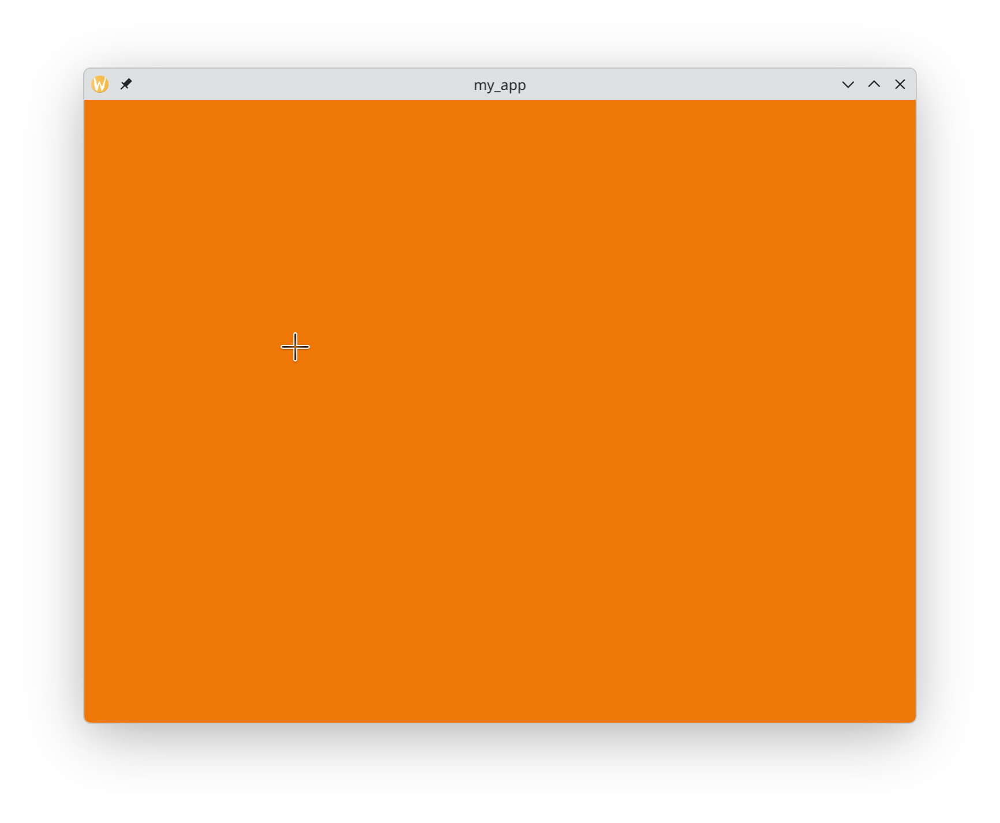

# The marvellous Simple DirectMedia Layer

Since you're reading this, it means you want to have fun with OCaml!
Indeed [SDL](https://www.libsdl.org/) has many features to play
with. Graphics, of course, but not only: do you want to fiddle with
your web cam? Do you want to save your program data in the user's
directory without worrying about the platform? To play wav files on
any available audio device? To control your app with your joystick?
Yes we can ;)

# SDL3 and OCaml

In 2025 (after several years of preparation), SDL underwent a major
makeover, transiting from SDL2 to SDL3. There are several OCaml
bindings for SDL2 ([tsdl](https://erratique.ch/software/tsdl) -- or
the ["compat"](https://github.com/sanette/tsdl) version for better
Windows compatibility, and
[ocamlsdl2](https://github.com/fccm2/OCamlSDL2)). But to my knowledge
`ocaml-sdl3` is currently the only one, and is still a work in
progress.  If you keep reading after this point, you must be very
adventurous and want to give it a try. Welcome!

# Results

_(If you are familiar with `tsdl`, you can skip this!)_

Most SDL functions don't throw an exception when they fail, they
simply return NULL or false, so that the programmer can easily deal
with it. Indeed, since SDL is a device library, an error does not mean
your program is necessarily bogus, it may just be that the device is
not reachable. You don't want your beautiful music player to crash
when the user switches to another audio device!

Like `tsdl`, `sdl3` uses extensively the OCaml `Result` module to
nicely collect the result value of all all these functions in a safe
way. For instance, when creating a window and a renderer, you can do
```ocaml
	match Sdl.create_window_and_renderer "my_app" 640 480 Sdl.window_resizable with
    | Error (`Msg e) -> Sdl.App.log "Couldn't create window/renderer: %s" e
    | Ok (window, renderer) -> (* do something which returns [unit] *)
```

Of course, this may seem a bit heavy. If you look at the official SDL
examples in C, a very similar code (with error logs) is used for this
function (`SDL_CreateWindowAndRenderer`), but for less critical
functions, like `Sdl_Renderpresent`, the error result is often simply
ignored. You can achieve this "unsafe" behaviour thanks to
`Result.get_ok`. For instance, define

```ocaml
	let go = Result.get_ok
```

and then use it like this:

```ocaml
	  Sdl.Renderer.present renderer |> go;
```

Note, this OCaml version is "safer" than the C code since it will
throw an exception in case of error.

You may also obtain "less heavy" constructions (depending on your
taste), even when you explicitely check for error, by using OCaml
["let-binding" operators](https://ocaml.org/manual/5.5/bindingops.html). For
instance, first define:

```ocaml
	let ( let* ) (o, errmsg) f =
		match o with
		| Error (`Msg e) -> Sdl.App.log "%s: %s" errmsg e
		| Ok x -> f x
```

and then you can use

```ocaml
	let* (window, renderer) = Sdl.create_window_and_renderer "my_app"
      640 480 Sdl.window_resizable, "Couldn't create window/renderer" in
	  (* do something which returns [unit] --- which may include more "let*" statements! *)
```

# My first app

The "hello world" equivalent is to open a window and fill it with a nice color.

```ocaml
open Sdl3

let go = Result.get_ok

let () =
  match Sdl.init Sdl.init_video with
  | Error (`Msg e) -> Sdl.App.log "Couldn't initialize SDL: %s" e
  | Ok () -> match Sdl.create_window_and_renderer "my_app" 640 480
                     Sdl.window_resizable with
  | Error (`Msg e) -> Sdl.App.log "Couldn't create window/renderer: %s" e
  | Ok (window, renderer) ->
    Sdl.Renderer.set_draw_color renderer 0xEE 0x77 0x06 Sdl.alpha_opaque |> go;
    Sdl.Renderer.clear renderer |> go;
    Sdl.Renderer.present renderer |> go;
    Sdl.delay 1000;
    Sdl.Renderer.destroy renderer;
    Sdl.Window.destroy window;
    Sdl.quit()
```

Save this to `my_app.ml`, compile as usual with `dune`, or directly:

```bash
	ocamlfind ocamlopt -package sdl3 -thread -linkpkg -o my_app my_app.ml
```

and then execute:

```bash
	./my_app
```



# Using `sdl3` in the toplevel

Nothing special, it should just work! Once you have installed `sdl3`
as an opam package, launch your favorite toplevel (`utop` or `ocaml`
configured with `down`), just type

```
#require "sdl3";;
```

Copy-paste the above code, add `;;` and RETURN, and the nice orange
window should popup!

Depending on your OCaml version, you might have to do
```
#thread;;
```
first. And depending on your OCaml install, you might have to do
```
#use "topfind";;
```
first, as well.

# Naming conventions

##  Summary (TL; DR)

SDL Names are converted to 'snake case', BUT...  lead by some
mysterious (and malicious) motivation, the author decided to group SDL
function into modules... and to modify names accordingly.

To find out the OCaml name of an SDL function, refer to this
[list](lib/bound_functions.csv): look at the columns "Module" and
"OCaml name": the full OCaml name is obtained by appending first
`Sdl.` then "Module" if it exists, to the "OCaml name":

```
	SDL_AcquireCameraFrame ==> Sdl.Camera.acquire_frame
	SDL_DelayPrecise ==> Sdl.delay_precise
```

## Lengthy explanation

In the original C language, All SDL functions have the "camel case"
form SDL_AaaaBbbbCccc... (except functions from `SDL_stdinc`), for
instance `SDL_GetRendererProperties`; there is no further
classification, no "module". The name are are long enough to remember
what the function does. But, in the OCaml world, we like modules! So
the game for us is to try to triage these functions into modules. This
is not compulsory, but we found it nice (why? maybe for automatically
grouping documentation). Of course we wish to keep similar names:

```
SDL_GetRendererProperties ==> Sdl.Renderer.get_properties
```

It turns out this is not so easy to do in an automatic way. Here are
the main rules currently implemented, but **they may change in the
future**. (They produce some funny/non-wanted corner cases.) In case
of doubt, refer to the file
[lib/bound_functions.csv](lib/bound_functions.csv).

+ The `SDL_` prefix is removed, and the global module name is `Sdl`.

+ After the following rules have been applied, Camel case is converted
  to snake case: `SDL_AaaaBbbb` ==> `Sdl.aaaa_bbbb`

+ If the function name contains `GetAaaa` or `CreateAaaa` "where
  `Aaaa` is the _type of the first argument_, then "Aaaa" is the
  module and we remove it from the function name:
  ```
	  SDL_GetRendererProperties ==> Sdl.Renderer.get_properties
  ```
  (the first argument has type `SDL_Renderer`.)

  The rule for "create" may sound surprising, it's there for dealing with a few cases like
  ```
	  SDL_CreateSurfacePalette ==> Sdl.Surface.create_palette
  ```
  (We don't want to create a "Palette" module, we see it as a sub-object of "Surface".)

+ If the _return type_ of the function is an `SDL_*` type or a pointer
  to an `SDL_*` type, and is part of the name of the function, then
  this type becomes the module, and any occurence of this type within
  the function name is removed.
  ```
	  SDL_CreateTextureFromSurface ==> Sdl.Texture.create_from_surface
  ```

+ If the type of the first argument is an `SDL_` type (or pointer to),
  and is part of the function name, it becomes the the module, and we
  remove it from the function name.
  ```
	  SDL_PauseAudioStreamDevice ==> Sdl.AudioStream.pause_device
  ```

+ If the name of the _header file_ is part of the function name, it
  becomes the the module, and we remove it from the function name.
  ```
	  SDL_SetAudioPostmixCallback ==> Sdl.Audio.set_postmix_callback
  ```

+ Avoid redundancies: `Sdl.Renderer.render_points ==> Sdl.render_points`

All of this looks nice and good, but you will see that it may lead to
wrong classification and weird names, so I have started to build a
list of custom cases (I leave it to you to discover the remaining
ones! don't hesitate to open an issue to record them.)
